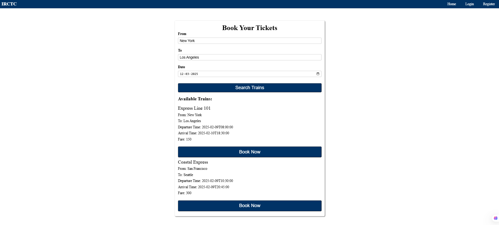
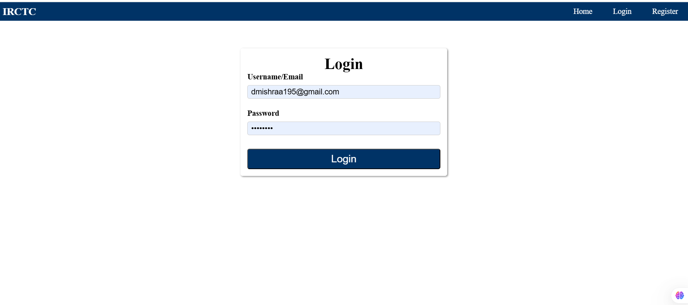
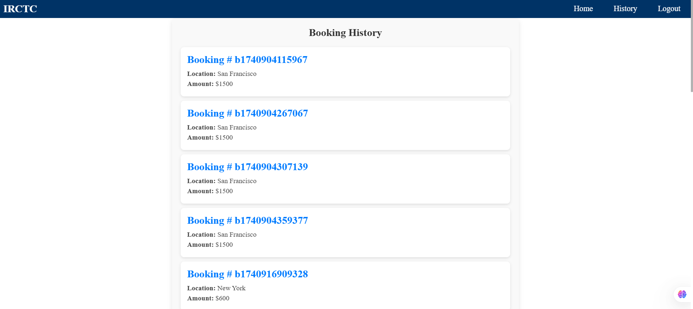

---

#### 📌 **iRCTC Train Booking App – `README.md`**  
```markdown
# iRCTC Train Booking App 🚆

## 🚀 Live Demo  
[Click Here](https://irctc-app-dkm3689s-projects.vercel.app/)  

## 📂 GitHub Repository  
[Click Here](https://github.com/dkm3689/IRCTC_App)

## 🛠 Tech Stack  
- React.js  
- Firebase  
- React Hooks (`useContext`, `useState`)  

## 📌 Features  
✔️ **Train Booking** - Users can search and book train tickets  
✔️ **Authentication** - Firebase Auth for secure login  
✔️ **Real-time Database** - Uses Firestore for storing bookings  
✔️ **State Management** - Uses React Hooks (`useContext`)  

## 📸 Screenshots  
 
  


## 🛠 Installation & Setup  
```bash
git clone https://github.com/your-username/irctc-booking-app.git
cd irctc-booking-app
npm install
npm start
